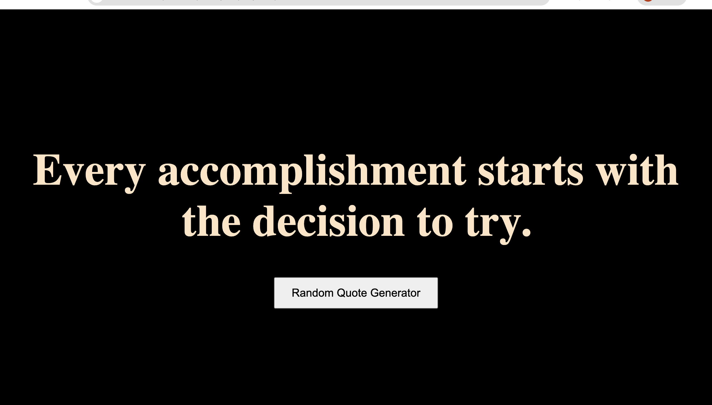
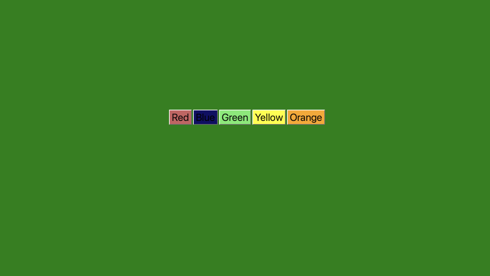
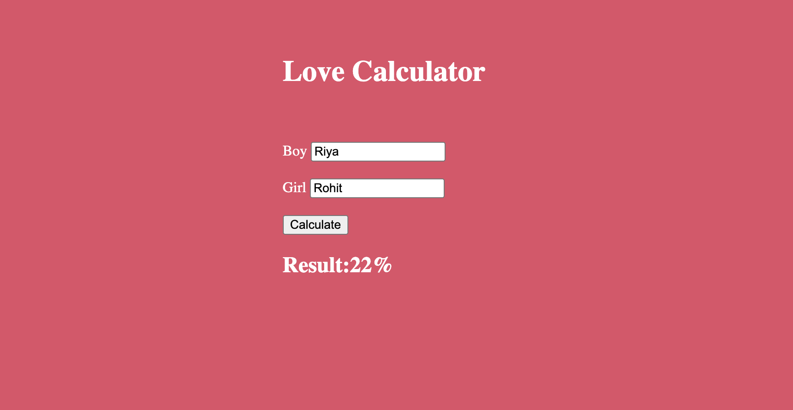
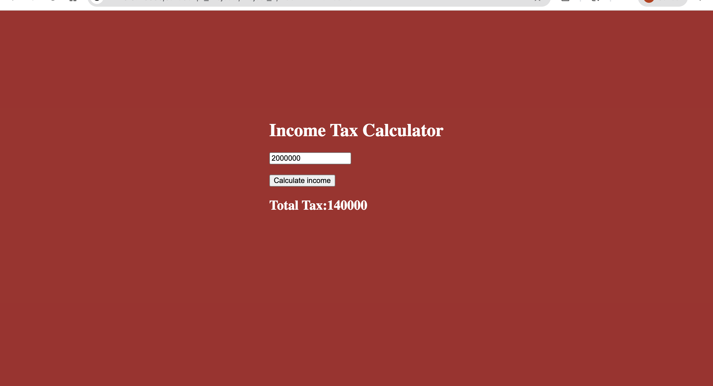
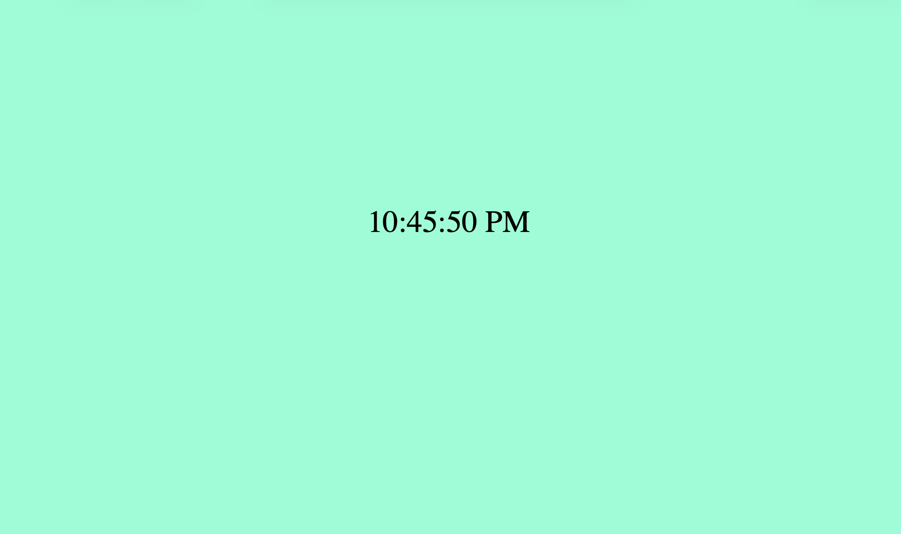
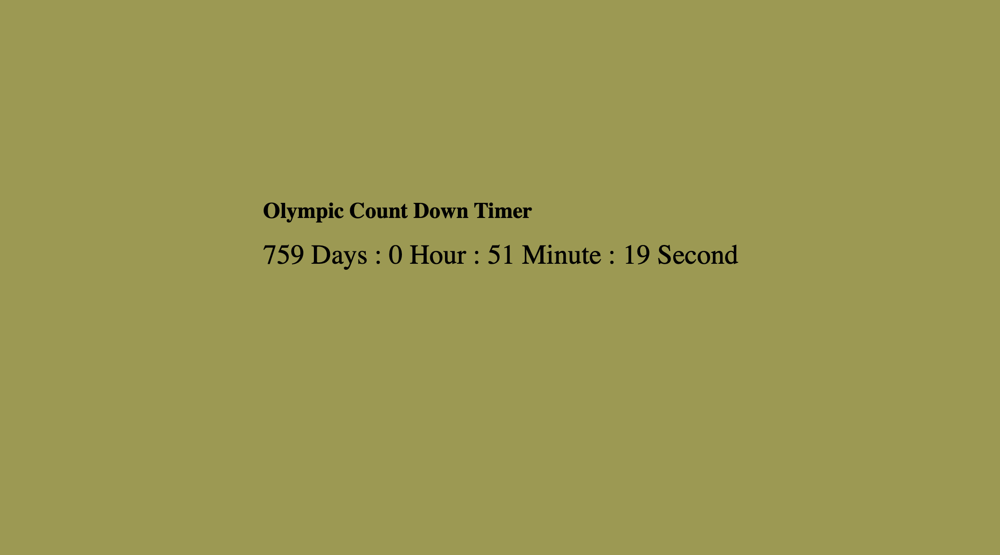
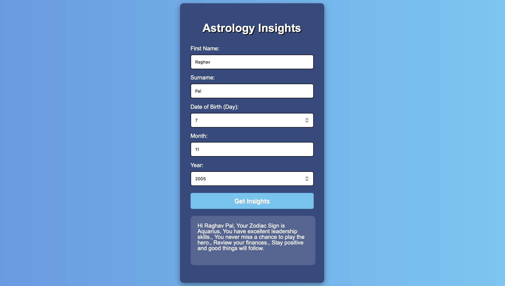
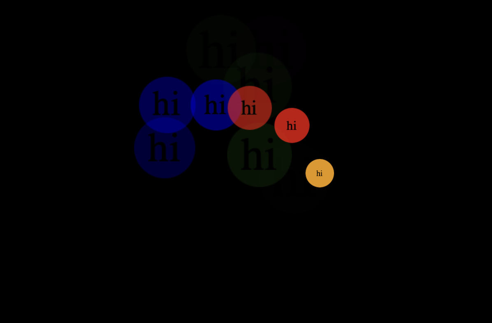
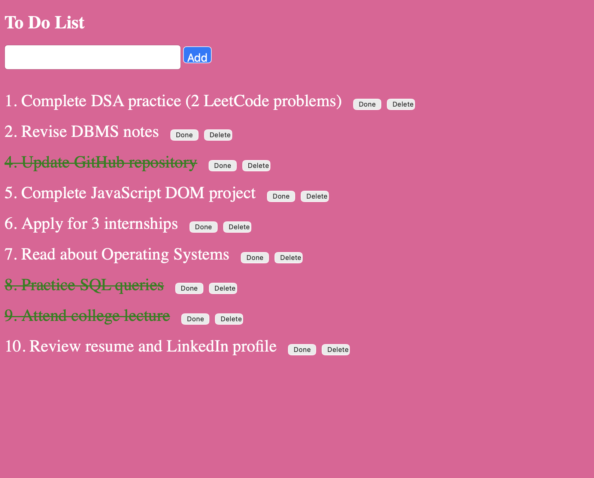
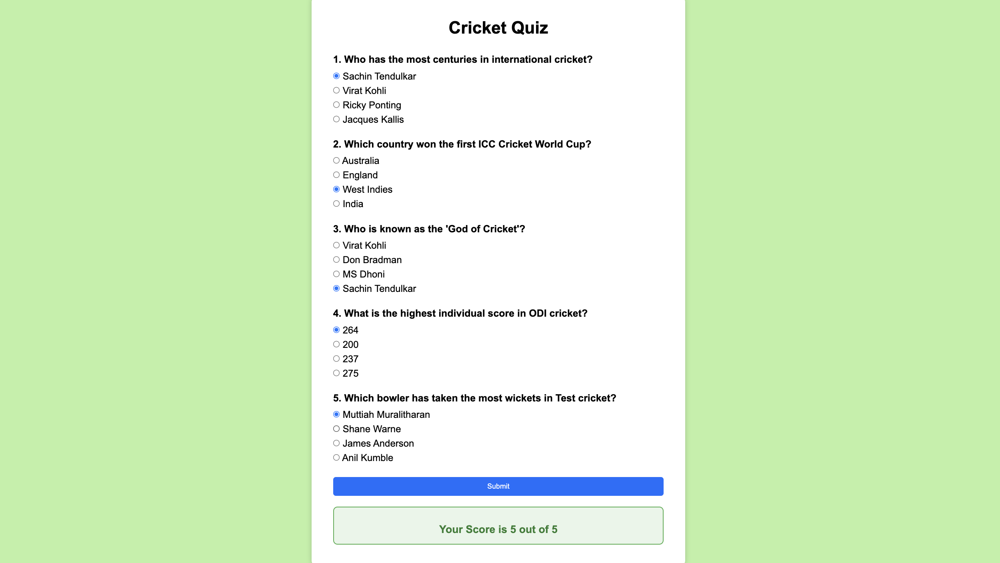

# 10 JavaScript Projects

A collection of beginner-friendly JavaScript projects built using HTML, CSS, and JavaScript. These projects help strengthen DOM manipulation, events, functions, timers, local storage, and API integration concepts.

## 📂 Projects Included

1. Random Quote Generator
2. Background Color Changer
3. Love Calculator
4. Income Tax Calculator
5. Digital Clock
6. Countdown Timer
7. Astrology App
8. Click Counter
9. To-Do List
10. Quiz App

---

## 1. Random Quote Generator

### Features
- Displays random motivational quotes
- Generate new quote on button click
- Responsive UI

### Tech Stack
- HTML
- CSS
- JavaScript

### Live Demo
https://your-demo-link.com/random-quote-generator

### Screenshot


---

## 2. Background Color Changer

### Features
- Changes background color randomly
- RGB/HEX color generation
- Displays current color code

### Live Demo
https://your-demo-link.com/background-color-changer

### Screenshot


---

## 3. Love Calculator

### Features
- Enter two names
- Generates compatibility percentage
- Fun animation effects

### Live Demo
https://your-demo-link.com/love-calculator

### Screenshot


---

## 4. Income Tax Calculator

### Features
- Enter annual income
- Calculates estimated tax
- User-friendly interface

### Live Demo
https://your-demo-link.com/income-tax-calculator

### Screenshot


---

## 5. Digital Clock

### Features
- Real-time clock
- Updates every second
- 12/24-hour format

### Live Demo
https://your-demo-link.com/digital-clock

### Screenshot


---

## 6. Countdown Timer

### Features
- Set countdown duration
- Start, pause, reset
- Alarm when timer finishes

### Live Demo
https://your-demo-link.com/countdown-timer

### Screenshot


---

## 7. Astrology App

### Features
- Zodiac sign finder
- Daily horoscope display
- Responsive design

### Live Demo
https://your-demo-link.com/astrology-app

### Screenshot


---

## 8. Click Counter

### Features
- Increment count
- Reset counter
- Track button clicks

### Live Demo
https://your-demo-link.com/click-counter

### Screenshot


---

## 9. To-Do List

### Features
- Add tasks
- Delete tasks
- Mark completed
- Local Storage support

### Live Demo
https://your-demo-link.com/todo-list

### Screenshot


---

## 10. Quiz App

### Features
- Multiple-choice questions
- Score tracking
- Final result screen

### Live Demo
https://your-demo-link.com/quiz-app

### Screenshot


---

##  Learning Outcomes

By completing these projects, you will gain hands-on experience with:

- JavaScript Fundamentals
- DOM Manipulation
- Event Handling
- Functions and Scope
- Arrays and Objects
- Timers (`setInterval`, `setTimeout`)
- Form Validation
- Local Storage
- Date and Time Operations
- Dynamic UI Updates
- Responsive Web Design
- Problem Solving and Logic Building

These projects are ideal for beginners looking to strengthen their JavaScript skills through practical implementation.

---

## 🤝 Contributing

Contributions are always welcome!

If you'd like to improve any project, add new features, fix bugs, or enhance the documentation, follow these steps:

### Steps to Contribute

1. Fork the repository
2. Create a new branch

```bash
git checkout -b feature/your-feature-name

 Installation

```bash
git clone https://github.com/yourusername/10-javascript-projects.git
cd 10-javascript-projects
